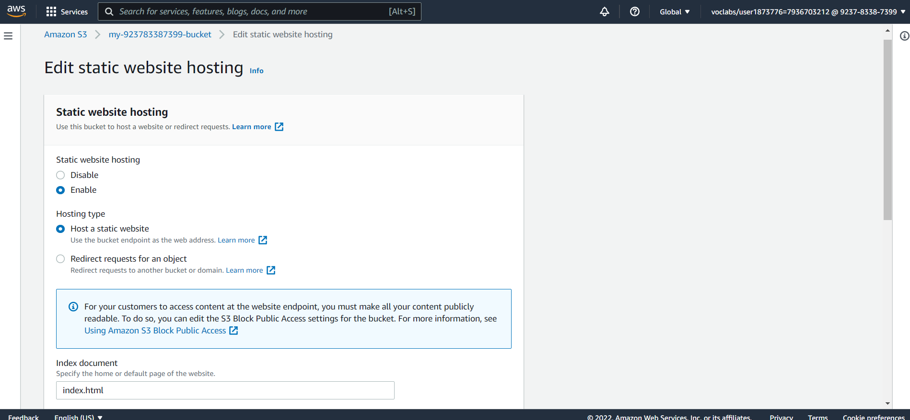

# Cloud-DevOps-Nanodegree-1st-Assessment

1. Creating a S3 bucket.

2. All website files added to the S3 bucket.

3. The bucket configuration setup to support static website hosting.

4. The permission access to the bucket configured.

5. The website distributed via Cloudfront.

# Links
CloudFront link:
https://d24d8ou775xrin.cloudfront.net/

Bucket website endpoint:
http://my-923783387399-bucket.s3-website.eu-west-3.amazonaws.com/